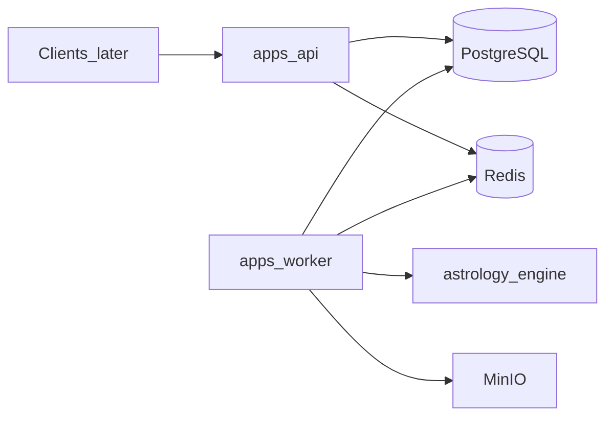

# System Overview

**Status:** Phase 1 scaffold implemented

## Summary

AstroGuruAI (AstroAI Lanka) is a multilingual astrology commerce platform. Customers manage birth profiles, purchase reports, pay online or via bank transfer, and receive AI-assisted PDFs asynchronously.

## Components (Current)

## Stack (Accepted ADRs)

| Layer | Choice |
|-------|--------|
| API / Worker | NestJS + TypeScript |
| DB | PostgreSQL + Prisma |
| Queue | Redis + BullMQ |
| Astrology | Python FastAPI (stub → Swiss Ephemeris) |
| Storage local | MinIO (S3 API) |
| Payments / AI | Adapters planned (PayHere, OpenAI/Gemini) |

## Source Documents

- SRS: [`docs/AstroAI_Lanka_SRS.md`](../AstroAI_Lanka_SRS.md)
- ADRs: [`docs/decisions/`](../decisions/)
